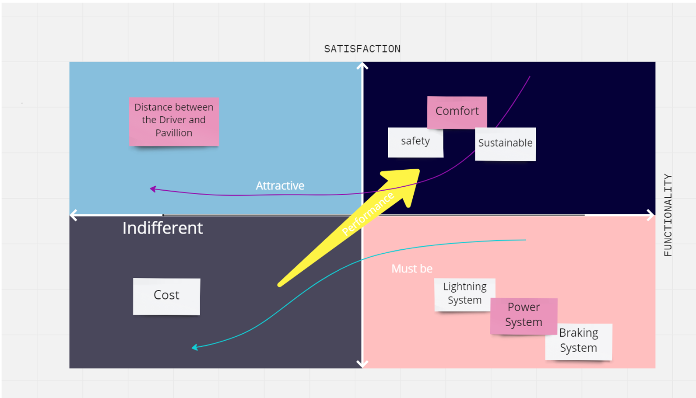
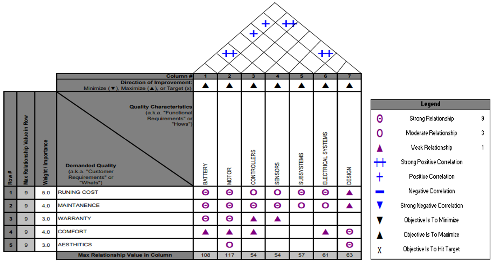

# Eco-Friendly E-Bike Taxi — MBSE & SysML

Model-Based Systems Engineering study for a low-cost electric bike taxi designed around passenger comfort, privacy, safety, and practical urban mobility.

This undergraduate team project translates stakeholder needs into a traceable system concept using **CATIA Magic**, **SysML**, **Kano analysis**, **Quality Function Deployment (QFD)**, functional decomposition, and structural, behavioral, and parametric models. The work was appreciated in an academic-industry setting involving Capgemini Engineering.

> **Repository purpose:** present the original project evidence clearly, explain how every model contributes to the architecture, and identify the design decisions that must be baselined before detailed engineering.

## Portfolio highlights

- Elicited and prioritized needs from **101 stakeholders**.
- Converted customer needs into system requirements and candidate specifications.
- Modeled the problem and solution using **nine SysML artifact types**.
- Connected service behavior, vehicle subsystems, external actors, power flow, and payment scenarios.
- Used a parametric model to begin mass and service-time verification.
- Applied a MagicGrid-inspired progression from stakeholder needs to system architecture.

## Problem and project scope

The project addresses two connected goals:

1. Improve passenger comfort and privacy—especially for women—through a revised seating arrangement that increases separation between the driver and pillion passenger.
2. Develop a low-cost electric bike-taxi concept using a model-based process rather than disconnected documents.

The principal stakeholder priorities captured in the presentation are:

| Priority | Engineering interpretation |
|---|---|
| Low cost | Reduce operating and maintenance cost while controlling component cost. |
| Comfort | Provide a separate dual-seat concept, footrest, armrest, and luggage space. |
| Avoid body contact | Extend and reorganize the frame/seating geometry. |
| Safety | Address braking, lighting, electrical control, and stable passenger accommodation. |
| Destination on time | Make ride booking, driver assignment, payment, and vehicle operation efficient. |

## Stakeholder evidence

The source presentation reports **101 respondents**: 69 students, 4 research scholars, and 28 employees. The gender distribution is 66 male and 35 female respondents.


The needs were consolidated into five high-level stakeholder requirements.


## Translating needs into engineering priorities

### Kano analysis

The project used the Kano model to distinguish basic expectations from performance and differentiating features:

- **Must-be:** lighting, power, and braking systems.
- **Performance:** comfort, safety, and sustainability.
- **Attractive:** increased distance between the driver and pillion passenger.
- **Indifferent in the source model:** cost.

The cost classification should be revisited because low cost is also recorded as a primary stakeholder requirement.



### Quality Function Deployment

The QFD matrix links customer concerns—running cost, maintenance, warranty, comfort, and aesthetics—to battery, motor, controller, sensors, subsystems, electrical systems, and overall design. The source matrix gives the highest weighted priorities to the **motor (117)** and **battery (108)**, followed by design (63), electrical systems (61), subsystems (57), controllers (54), and sensors (54).



## MagicGrid-inspired model organization

The model separates the problem domain from the solution domain. The black-box view captures stakeholder needs, use cases, system context, and effectiveness measures. The white-box view decomposes functions and logical subsystems. System requirements then connect the problem definition to a candidate architecture.


The complete diagram-by-diagram explanation is available in the [MBSE model walkthrough](docs/MBSE_MODEL_WALKTHROUGH.md).

## System concept

The source architecture identifies these primary elements:

| Element | Concept-stage specification or responsibility |
|---|---|
| Vehicle frame | Tubular structure; geometry modified for passenger separation and seating comfort. |
| Battery | Lithium-ion; 48 V appears in the functional table and 3 kWh appears in the requirement model. |
| Traction motor | Competing concepts appear: 3.0–4.4 kW BLDC hub motor with 140 Nm peak torque, and an 8.5 kW mid-drive IPM requirement. |
| Controller | Power-electronics and embedded-control unit; sine-wave control is proposed for smoother acceleration. |
| DC-DC converter | Supplies 12 V auxiliaries; a bidirectional 36/48/60 V-to-12 V requirement is recorded. |
| Seat | Separate dual-seat concept connected to the extended frame. |
| Braking | The artifacts include regenerative-braking intent, a drum-brake concept, and a combined dual-disc requirement. |
| Wheels and tyres | R10 wheel and R12 tyre are listed and require dimensional reconciliation. |
| Auxiliary systems | Horn, lighting, indicators/blinkers, and back light. |
| Luggage carrier | Concept dimension of 200 × 200 mm attached to the chassis. |


These values are retained exactly as concept-stage evidence. They are not presented as a released design baseline; the competing motor, brake, and wheel specifications must be resolved through trade studies and configuration control.

## SysML architecture set

| View | Question answered | Project evidence |
|---|---|---|
| Package diagram | How is the model organized? | Problem/solution domains, black-box/white-box analysis, requirements, context, use cases, functions, and logical subsystems. |
| Requirement diagram | What must the system satisfy? | Comfort/privacy geometry, low operating cost, battery, motor, controller, converter, and braking requirements. |
| Use-case diagram | Who interacts with the system and why? | Customers, driver, organization, bank, vendor/manpower, power source, and charging infrastructure. |
| Activity diagram | What end-to-end work occurs? | Program creation, driver assignment, vehicle activation, electrical functions, booking, payment, and trip completion. |
| Sequence diagram | In what order do actors exchange information? | Booking, destination entry, fare estimate, driver assignment, payment alternatives, confirmation, and cancellation. |
| Block Definition Diagram | What is the system made of? | Frame, horn, wheels, brakes, seat, converter, controller, motor, and battery. |
| Internal Block Diagram | How do internal parts exchange power and signals? | External power, electrical unit, frame, lighting, braking, and horn interfaces. |
| State Machine | How does the system change state? | Service workflow and vehicle power/control behavior. |
| Parametric diagram | How are quantitative constraints connected? | Vehicle mass and five-minute booking/payment requirement. |

## Traceability example

| Stakeholder need | Derived design response | Model evidence | Suggested verification |
|---|---|---|---|
| Avoid body contact | Extend frame by 600 mm and separate seating positions. | Requirement diagram, Kano model, frame block. | Ergonomic mock-up and dimensional inspection. |
| Comfort and safety | Footrest, armrest, luggage space, seat geometry, braking, and lighting. | Requirements, BDD, IBD, state machine. | Ergonomic review, load test, braking test, and lighting inspection. |
| Low cost | Prioritize motor/battery trade-offs and low operating cost. | QFD and low-travel-cost requirement. | Lifecycle-cost model and energy-use test. |
| Destination on time | Booking and payment in less than five minutes. | Sequence and parametric diagrams. | Timed scenario execution. |
| Luggage support | 200 × 200 mm carrier concept attached to the chassis. | Functional analysis and block structure. | Static-load and attachment-strength test. |

## Engineering review findings

The models demonstrate broad MBSE coverage, but the following items should be closed before a design review:

1. Select and baseline one traction architecture: BLDC hub motor or mid-drive IPM motor.
2. Reconcile motor power: 3.0–4.4 kW peak versus 8.5 kW.
3. Select and baseline the braking architecture: drum, dual-disc/combined braking, and regenerative behavior.
4. Reconcile the R10 wheel and R12 tyre entries.
5. Complete all mass properties and bind every subsystem to the total-mass equation.
6. Replace placeholder parametric values with calculated or measured values.
7. Define verification methods and acceptance criteria for every system requirement.
8. Add explicit requirement-to-function and requirement-to-block traceability matrices.

See [Requirements and design review](docs/REQUIREMENTS_AND_DESIGN_REVIEW.md) for the detailed assessment.

## Repository contents

```text
E-Bike-Taxi-MBSE/
├── assets/
│   ├── analysis/              # Stakeholder, Kano, QFD, functional and timeline evidence
│   └── diagrams/              # Original SysML/CATIA Magic diagrams extracted from the deck
├── docs/
│   ├── MBSE_MODEL_WALKTHROUGH.md
│   ├── REQUIREMENTS_AND_DESIGN_REVIEW.md
│   ├── SOURCES.md
│   └── Project_Presentation.pdf
└── README.md
```

The original PowerPoint contains a 97 MB embedded video and exceeds GitHub's normal 100 MB single-file limit. A visually verified, flattened 32-slide PDF is included instead: [view the project presentation](docs/Project_Presentation.pdf).

## Project timeline

The source plan progresses from concept selection in January through literature review, stakeholder and system requirements, functional analysis, SysML modeling in April, and report preparation in May.


## Skills demonstrated

**Systems engineering:** stakeholder elicitation, requirements decomposition, traceability, functional analysis, system context, architecture definition, interface modeling, behavior modeling, and verification planning.

**Methods and tools:** MBSE, SysML, CATIA Magic/No Magic, MagicGrid, Kano model, QFD, use cases, activity and sequence modeling, BDD, IBD, state machines, and parametric modeling.

**Mechanical/electrical integration:** chassis and seating concept, battery, motor, controller, converter, braking, wheels, auxiliaries, and luggage-carrier integration.

## Attribution

This repository documents a team project completed at **Dr. Mahalingam College of Engineering and Technology**. It is maintained as a portfolio artifact by **Pratheswaran Hariharan**.

[Portfolio](https://pratheswaran.com) · [LinkedIn](https://www.linkedin.com/in/pratheswaran-hariharan-a78382214/) · [GitHub](https://github.com/Pratheswaran)

