# MBSE architecture walkthrough

This document pairs selected project screenshots supplied by the project author with GitHub-renderable Mermaid explanations. The screenshots preserve the original analysis and CATIA Magic/SysML evidence; the Mermaid views clarify the engineering meaning and remain readable at repository scale. Neither format replaces the underlying SysML model.

## Architecture at a glance

The MBSE flow preserves a line of reasoning from stakeholder evidence to verification planning.

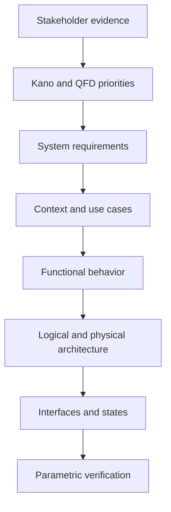
```mermaid
flowchart TD
    A["Stakeholder evidence"] --> B["Kano and QFD priorities"]
    B --> C["System requirements"]
    C --> D["Context and use cases"]
    D --> E["Functional behavior"]
    E --> F["Logical and physical architecture"]
    F --> G["Interfaces and states"]
    G --> H["Parametric verification"]
```

The concept architecture connects the traction path, auxiliary electrical loads, and vehicle structure.

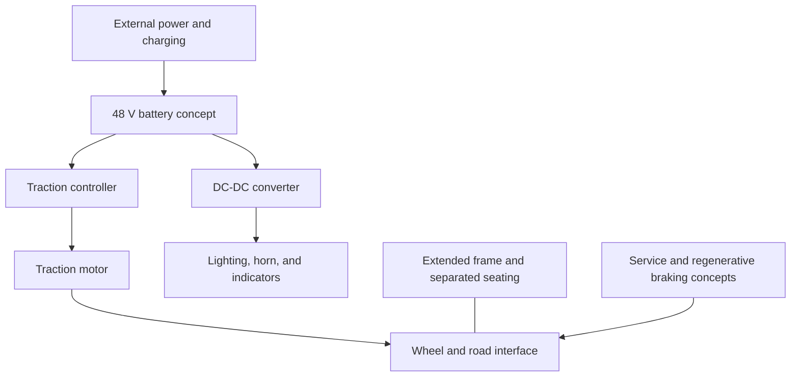
```mermaid
flowchart TB
    CHG["External power and charging"] --> BAT["48 V battery concept"]
    BAT --> CTRL["Traction controller"]
    CTRL --> MOTOR["Traction motor"]
    MOTOR --> ROAD["Wheel and road interface"]
    BAT --> CONV["DC-DC converter"]
    CONV --> AUX["Lighting, horn, and indicators"]
    FRAME["Extended frame and separated seating"] --- ROAD
    BRAKE["Service and regenerative braking concepts"] --> ROAD
```

Competing motor, brake, and wheel specifications remain open configuration decisions, as documented in the [requirements and design review](REQUIREMENTS_AND_DESIGN_REVIEW.md).

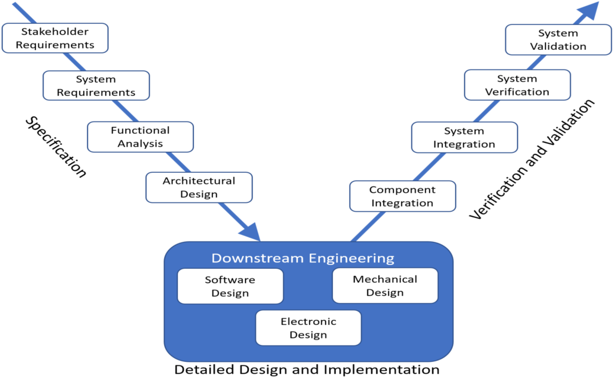

*The project follows a V-model progression from stakeholder requirements and system architecture to integration, verification, and validation.*

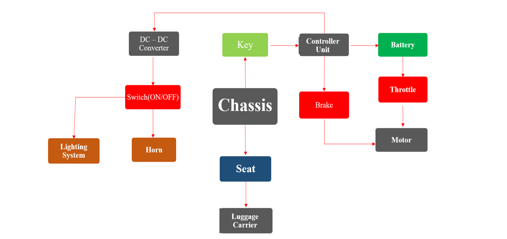

*The functional view connects the chassis, energy conversion, traction, braking, and auxiliary systems.*

## 1. Package diagram — model organization

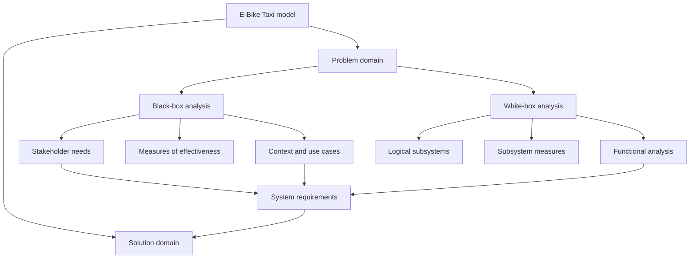
```mermaid
flowchart TD
    MODEL["E-Bike Taxi model"] --> PROBLEM["Problem domain"]
    MODEL --> SOLUTION["Solution domain"]
    PROBLEM --> BLACK["Black-box analysis"]
    PROBLEM --> WHITE["White-box analysis"]
    BLACK --> NEEDS["Stakeholder needs"]
    BLACK --> CONTEXT["Context and use cases"]
    BLACK --> MOE["Measures of effectiveness"]
    WHITE --> FUNCTIONS["Functional analysis"]
    WHITE --> LOGICAL["Logical subsystems"]
    WHITE --> SUBMOE["Subsystem measures"]
    NEEDS --> REQ["System requirements"]
    CONTEXT --> REQ
    FUNCTIONS --> REQ
    REQ --> SOLUTION
```

**Purpose.** The package organization defines where model information belongs and separates problem analysis from candidate solution definition.

**Engineering meaning.** This follows the main MagicGrid principle: understand the system from the outside before decomposing it internally. It supports navigation, ownership, and traceability across requirements, behavior, structure, and parameters.

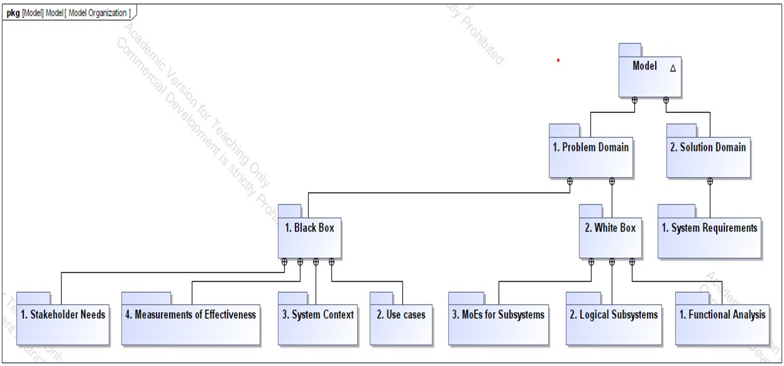

## 2. Requirement diagrams — from needs to specifications

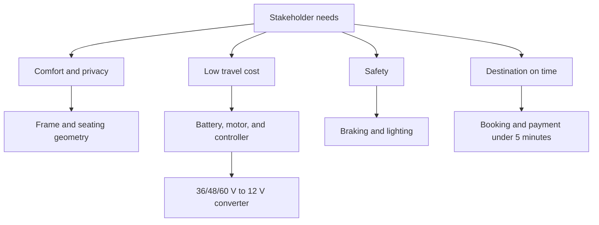
```mermaid
flowchart TD
    NEED["Stakeholder needs"] --> COMFORT["Comfort and privacy"]
    NEED --> COST["Low travel cost"]
    NEED --> SAFETY["Safety"]
    NEED --> TIME["Destination on time"]
    COMFORT --> FRAME["Frame and seating geometry"]
    COST --> POWER["Battery, motor, and controller"]
    SAFETY --> BRAKES["Braking and lighting"]
    TIME --> SERVICE["Booking and payment under 5 minutes"]
    POWER --> CONVERTER["36/48/60 V to 12 V converter"]
```

Key requirements visible in the source model include:

- Extend the vehicle frame by 600 mm.
- Keep total vehicle length at or below 1.8 m and wheelbase at or below 1.3 m.
- Use a frame diameter between 65 and 75 mm.
- Provide 150 mm ground clearance.
- Target a seat height of 650–700 mm and vehicle width of 350–400 mm.
- Add footrest, armrest, luggage space, and separated seating provisions.
- Use a 3 kWh lithium-ion battery concept.
- Evaluate an 8.5 kW mid-drive IPM motor requirement.
- Use a sine-wave controller for smoother acceleration.
- Provide a bidirectional converter capable of producing 12 V from a 36/48/60 V source.
- Provide combined braking and dual-disc braking.

The requirement evidence also exposes concept conflicts when compared with the functional-analysis values. Those conflicts are retained and assessed in the design-review file rather than silently reconciled.

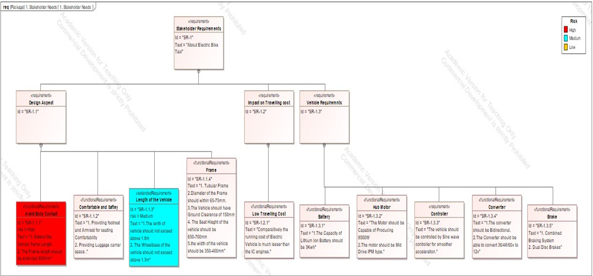

## 3. Use-case diagram — system responsibilities and actors

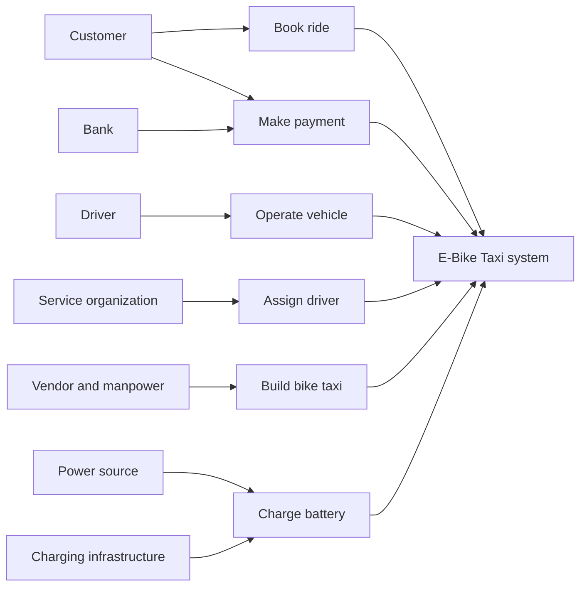
```mermaid
flowchart LR
    CUSTOMER["Customer"] --> BOOK["Book ride"]
    CUSTOMER --> PAY["Make payment"]
    DRIVER["Driver"] --> OPERATE["Operate vehicle"]
    ORG["Service organization"] --> ASSIGN["Assign driver"]
    BANK["Bank"] --> PAY
    VENDOR["Vendor and manpower"] --> BUILD["Build bike taxi"]
    POWER["Power source"] --> CHARGE["Charge battery"]
    INFRA["Charging infrastructure"] --> CHARGE
    BOOK --> SYSTEM["E-Bike Taxi system"]
    PAY --> SYSTEM
    OPERATE --> SYSTEM
    ASSIGN --> SYSTEM
    BUILD --> SYSTEM
    CHARGE --> SYSTEM
```

The system-level work includes making the bike taxi, battery, charger, and frame; aligning the seating position; providing charging availability; booking a ride; assigning a driver; and completing payment. The view keeps external participants outside the system boundary while showing why their interfaces matter.

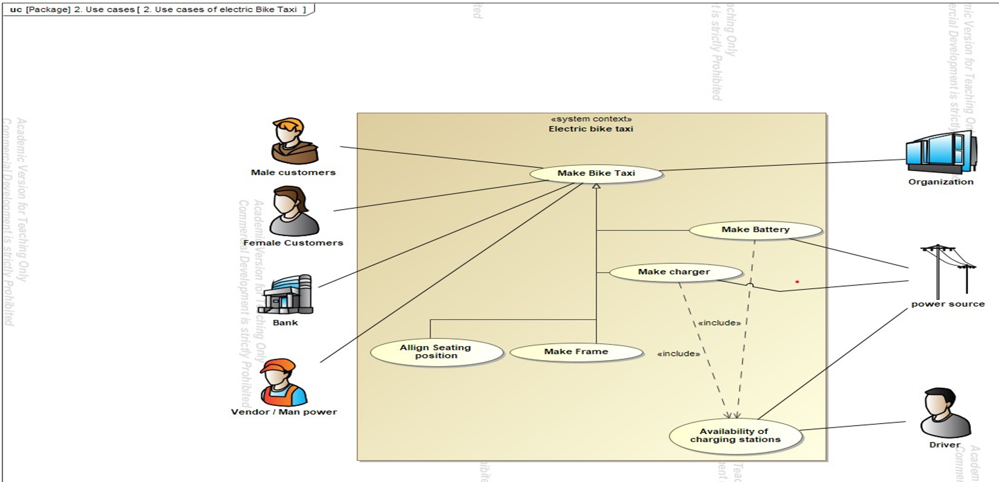

## 4. System-context diagram — external interfaces

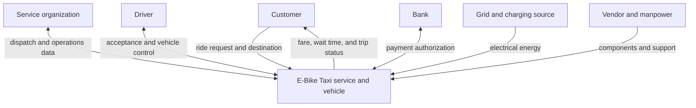
```mermaid
flowchart TB
    CUSTOMER["Customer"] -->|"ride request and destination"| SYSTEM["E-Bike Taxi service and vehicle"]
    SYSTEM -->|"fare, wait time, and trip status"| CUSTOMER
    ORG["Service organization"] <-->|"dispatch and operations data"| SYSTEM
    DRIVER["Driver"] <-->|"acceptance and vehicle control"| SYSTEM
    BANK["Bank"] <-->|"payment authorization"| SYSTEM
    POWER["Grid and charging source"] -->|"electrical energy"| SYSTEM
    VENDOR["Vendor and manpower"] -->|"components and support"| SYSTEM
```

This is the boundary-control view: it identifies what the system owns, what remains external, and which physical, financial, or informational exchanges cross the boundary.

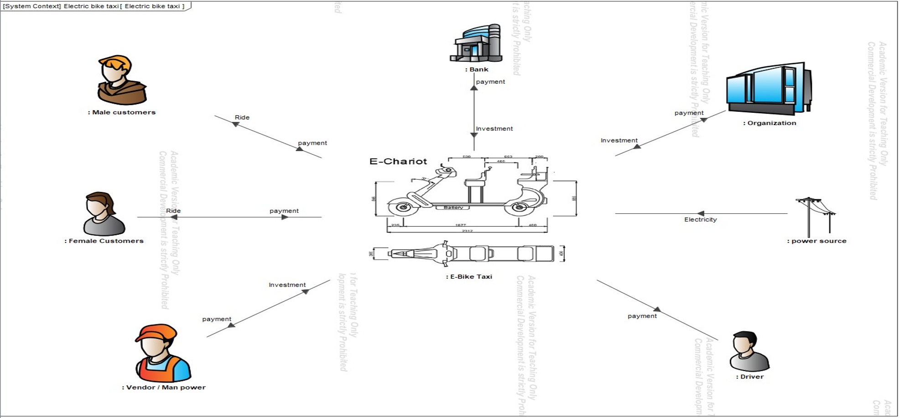

## 5. Activity diagram — end-to-end behavior

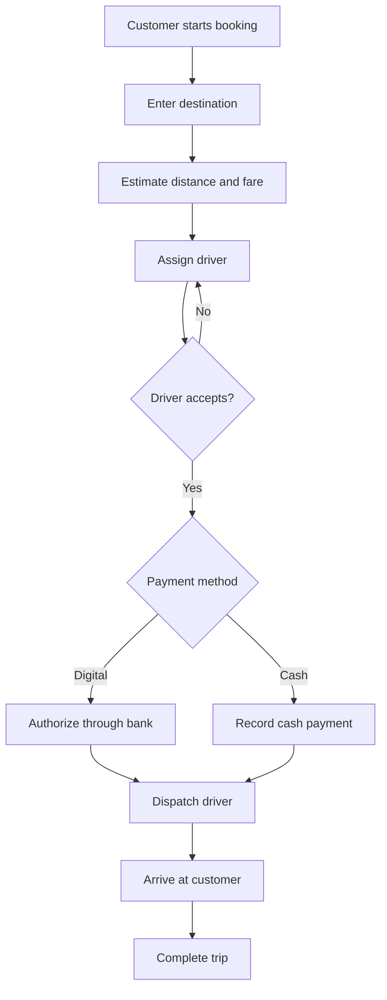
```mermaid
flowchart TD
    START["Customer starts booking"] --> DEST["Enter destination"]
    DEST --> EST["Estimate distance and fare"]
    EST --> ASSIGN["Assign driver"]
    ASSIGN --> ACCEPT{"Driver accepts?"}
    ACCEPT -->|"No"| ASSIGN
    ACCEPT -->|"Yes"| PAY{"Payment method"}
    PAY -->|"Digital"| AUTHORIZE["Authorize through bank"]
    PAY -->|"Cash"| RECORD["Record cash payment"]
    AUTHORIZE --> DISPATCH["Dispatch driver"]
    RECORD --> DISPATCH
    DISPATCH --> ARRIVE["Arrive at customer"]
    ARRIVE --> TRIP["Complete trip"]
```

The vehicle-control portion links key-on activation, controller, converter, battery, throttle, motor, brake, horn, lighting, and indicators. Those actions should later be allocated to blocks and refined with typed signal and power flows.

## 6. Sequence diagrams — booking and payment interaction

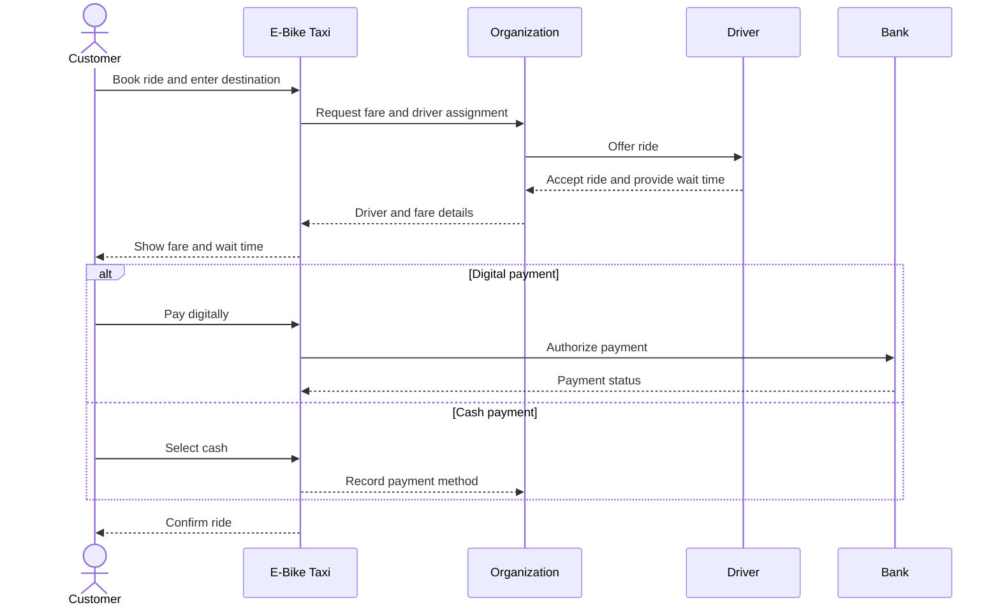
```mermaid
sequenceDiagram
    actor Customer
    participant System as E-Bike Taxi
    participant Org as Organization
    participant Driver
    participant Bank
    Customer->>System: Book ride and enter destination
    System->>Org: Request fare and driver assignment
    Org->>Driver: Offer ride
    Driver-->>Org: Accept ride and provide wait time
    Org-->>System: Driver and fare details
    System-->>Customer: Show fare and wait time
    alt Digital payment
        Customer->>System: Pay digitally
        System->>Bank: Authorize payment
        Bank-->>System: Payment status
    else Cash payment
        Customer->>System: Select cash
        System-->>Org: Record payment method
    end
    System-->>Customer: Confirm ride
```

Each message can become a software or service requirement with timing, data, exception handling, and acceptance criteria. A timeout or cancellation branch should be modeled explicitly in the next increment.

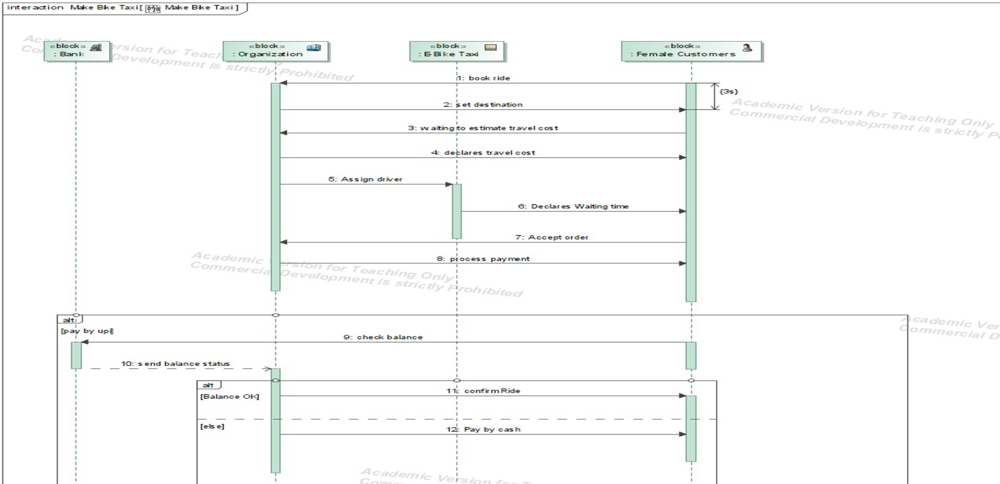

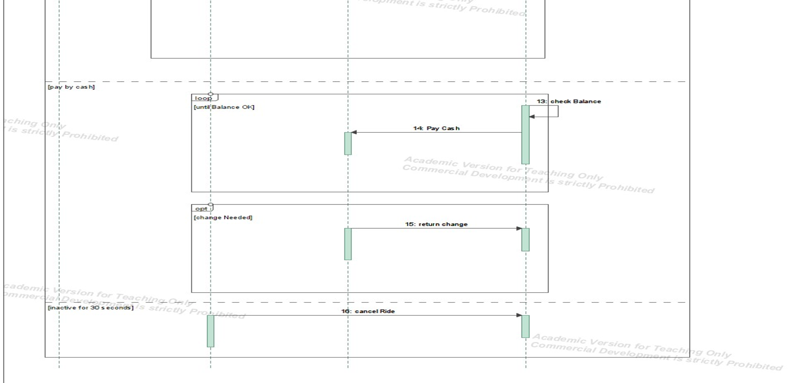

## 7. Block Definition Diagram — system decomposition

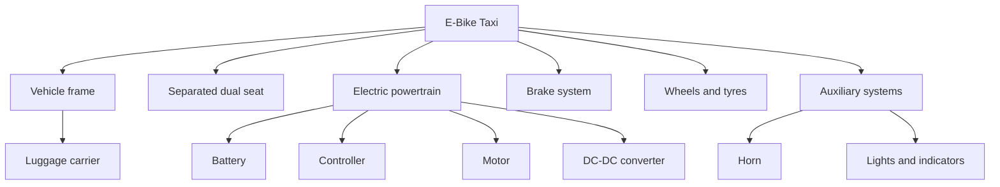
```mermaid
flowchart TD
    SYSTEM["E-Bike Taxi"] --> FRAME["Vehicle frame"]
    SYSTEM --> SEAT["Separated dual seat"]
    SYSTEM --> POWER["Electric powertrain"]
    SYSTEM --> BRAKE["Brake system"]
    SYSTEM --> WHEELS["Wheels and tyres"]
    SYSTEM --> AUX["Auxiliary systems"]
    POWER --> BAT["Battery"]
    POWER --> CTRL["Controller"]
    POWER --> MOTOR["Motor"]
    POWER --> CONV["DC-DC converter"]
    AUX --> HORN["Horn"]
    AUX --> LIGHTS["Lights and indicators"]
    FRAME --> CARRIER["Luggage carrier"]
```

The BDD answers **what exists** and establishes reusable types. It does not by itself show how parts exchange energy or signals; that is the purpose of the internal-interface view.

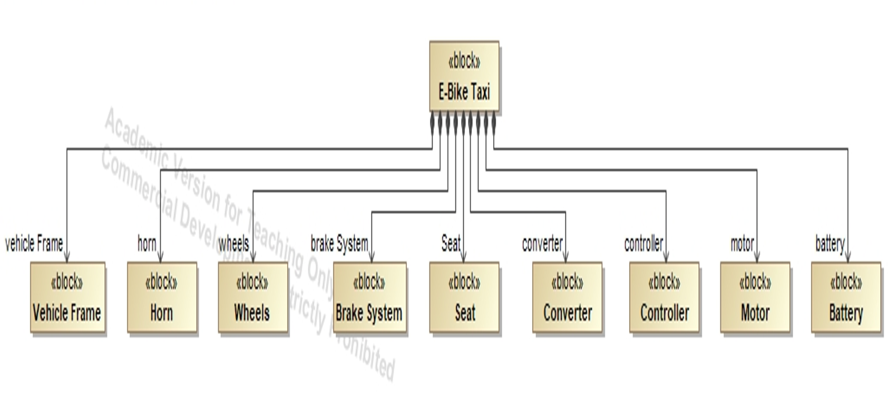

## 8. Internal Block Diagram — internal interfaces

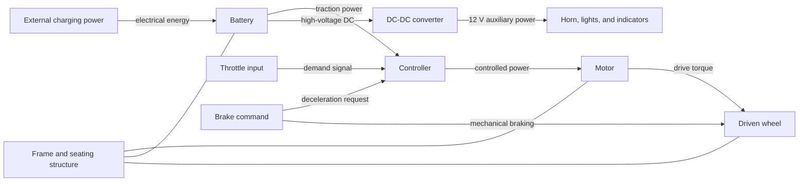
```mermaid
flowchart LR
    GRID["External charging power"] -->|"electrical energy"| BAT["Battery"]
    BAT -->|"traction power"| CTRL["Controller"]
    THROTTLE["Throttle input"] -->|"demand signal"| CTRL
    CTRL -->|"controlled power"| MOTOR["Motor"]
    MOTOR -->|"drive torque"| WHEEL["Driven wheel"]
    BAT -->|"high-voltage DC"| CONV["DC-DC converter"]
    CONV -->|"12 V auxiliary power"| AUX["Horn, lights, and indicators"]
    BRAKE["Brake command"] -->|"deceleration request"| CTRL
    BRAKE -->|"mechanical braking"| WHEEL
    FRAME["Frame and seating structure"] --- MOTOR
    FRAME --- BAT
    FRAME --- WHEEL
```

A production model should refine every connector with direction, voltage/current range, signal type, connector definition, failure behavior, and verification method.

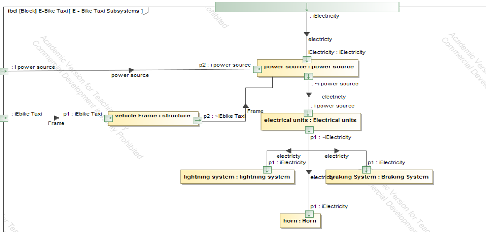

## 9. State machines — service and vehicle modes

### Service states

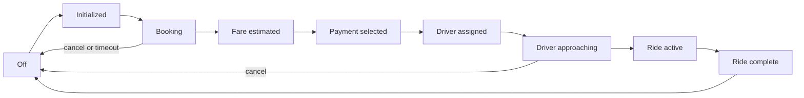
```mermaid
flowchart LR
    OFF["Off"] --> INIT["Initialized"]
    INIT --> BOOK["Booking"]
    BOOK --> PRICE["Fare estimated"]
    PRICE --> PAYMENT["Payment selected"]
    PAYMENT --> ASSIGNED["Driver assigned"]
    ASSIGNED --> WAITING["Driver approaching"]
    WAITING --> ACTIVE["Ride active"]
    ACTIVE --> COMPLETE["Ride complete"]
    BOOK -->|"cancel or timeout"| OFF
    WAITING -->|"cancel"| OFF
    COMPLETE --> OFF
```

### Vehicle states

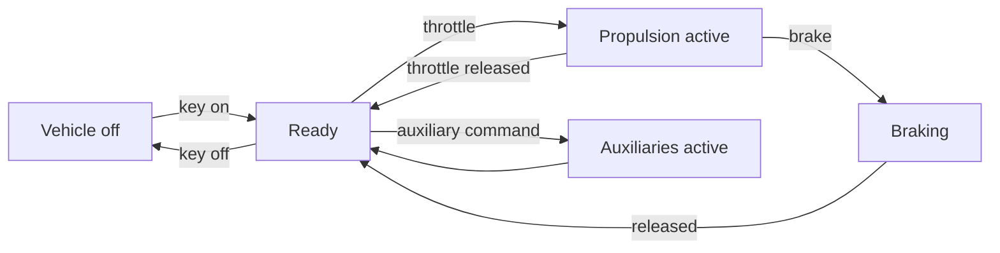
```mermaid
flowchart LR
    V_OFF["Vehicle off"] -->|"key on"| READY["Ready"]
    READY -->|"throttle"| DRIVE["Propulsion active"]
    DRIVE -->|"brake"| BRAKING["Braking"]
    BRAKING -->|"released"| READY
    DRIVE -->|"throttle released"| READY
    READY -->|"auxiliary command"| AUX["Auxiliaries active"]
    AUX --> READY
    READY -->|"key off"| V_OFF
```

These views should ultimately use named events, guards, timeouts, and entry/exit actions so they can be simulated and verified.

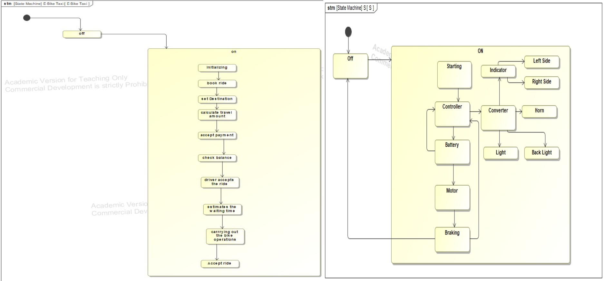

## 10. Parametric diagram — quantitative verification

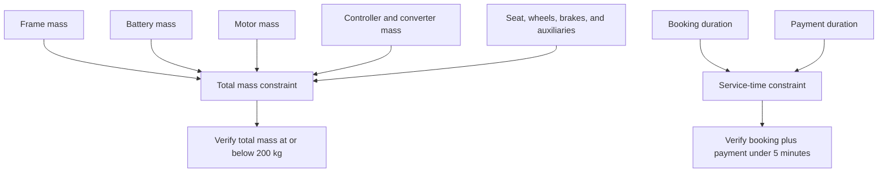
```mermaid
flowchart TD
    FRAME["Frame mass"] --> MASS["Total mass constraint"]
    BAT["Battery mass"] --> MASS
    MOTOR["Motor mass"] --> MASS
    CTRL["Controller and converter mass"] --> MASS
    OTHER["Seat, wheels, brakes, and auxiliaries"] --> MASS
    MASS --> LIMIT["Verify total mass at or below 200 kg"]
    BOOK["Booking duration"] --> TIME["Service-time constraint"]
    PAY["Payment duration"] --> TIME
    TIME --> TLIMIT["Verify booking plus payment under 5 minutes"]
```

The source model introduces a total-vehicle-mass limit of 200 kg and a five-minute booking/payment requirement. The parametric prototype is incomplete: only the frame shows a mass value, most component values remain unset, and the original equation does not bind every subsystem. It should therefore be treated as a verification pattern, not evidence that either requirement has passed.

## End-to-end traceability

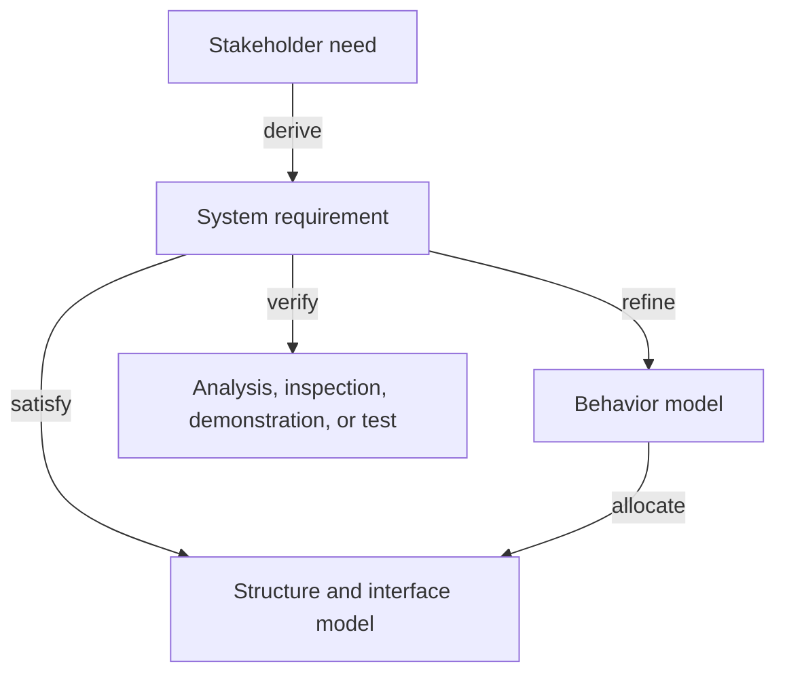
```mermaid
flowchart TD
    N["Stakeholder need"] -->|"derive"| R["System requirement"]
    R -->|"refine"| B["Behavior model"]
    R -->|"satisfy"| S["Structure and interface model"]
    B -->|"allocate"| S
    R -->|"verify"| V["Analysis, inspection, demonstration, or test"]
```

The next modeling increment should make this chain explicit in CATIA Magic with `deriveReqt`, `refine`, `satisfy`, `verify`, and allocation relationships plus requirement-to-model matrices.
